# 📋 Inscription – Guide de structure

Ce dossier contient tout le code lié au **formulaire d’inscription** à l’association.

---

## 📂 Arborescence

```txt
inscription/
├── Form.tsx # Composant principal du formulaire (RegisterForm)
├── formCard.tsx # Carte wrapper du formulaire
├── page.tsx # Page Next.js
├── registerMember.ts # Action server pour persister un membre
├── (StepForms)/ # Sous-formulaires (UI par étape)
│ ├── Authorization.tsx
│ ├── Courses.tsx
│ ├── LegalGuardians.tsx
│ ├── Member.tsx
│ └── Resume.tsx
└── formUtils/ # Logique partagée et outils
├── constants.ts # Constantes globales (upload, MIME, etc.)
├── stepper.ts # Définition du stepper (ordre et schemas)
├── types.ts # Types Prisma/Zod liés au formulaire
├── schemas/ # Validation Zod par étape
│ ├── courses.ts
│ ├── member.ts
│ ├── legalGuardians.ts
│ ├── authorization.ts
│ └── resume.ts
└── index.ts # Barrel file : ré-exporte constants, schemas, stepper, etc.
```

---

## 🧩 Composants principaux

- **`Form.tsx`**  
  - Initialise `useForm` et `useStepper`  
  - Définit la logique de navigation (suivant / précédent)  
  - Rassemble les sous-formulaires `(StepForms)`  

- **Sous-formulaires `(StepForms)`**  
  - Chaque fichier correspond à une étape du stepper  
  - Contient uniquement de l’UI + bindings aux champs du schema  

---

## ✅ Validation

- Chaque étape a un **schema Zod** (dans `formUtils/schemas/`).  
- Ces schemas sont regroupés dans `stepper.ts` pour associer un index, un label et une validation.  
- Les constantes communes (`MAX_UPLOAD_SIZE`, `ACCEPTED_FILE_TYPES`, …) sont dans `constants.ts`.  

---

## 🔄 Workflow

1. L’utilisateur remplit une étape → `zodResolver` valide.  
2. `useStepper` gère le passage à l’étape suivante.  
3. À la dernière étape, `onSubmit` appelle `registerMember.ts` (server action).  
4. En cas de succès : redirection + toast.  

---

## 🚀 Ajouter une nouvelle étape

1. Créer un **schema** dans `formUtils/schemas/`.  
2. Ajouter l’entrée correspondante dans `formUtils/stepper.ts`.  
3. Créer un **sous-formulaire** dans `(StepForms)/`.  
4. Ajouter le rendu conditionnel dans `Form.tsx`.  

---

## 📊 Schéma du stepper

```mermaid
flowchart LR
    A[👤 Membre] --> B[👨‍👩‍👧 Tuteurs légaux]
    B --> C[📚 Cours]
    C --> D[📝 Autorisations]
    D --> E[📄 Résumé]
    E --> F[✅ Enregistrement]
```



---

📌 Astuce

Utiliser formUtils/index.ts pour importer facilement :

```typescript
import { useStepper, MemberSchema, MAX_UPLOAD_SIZE } from "./formUtils";
```

